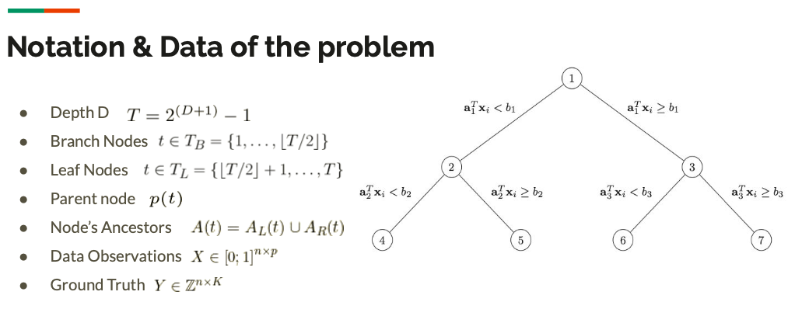
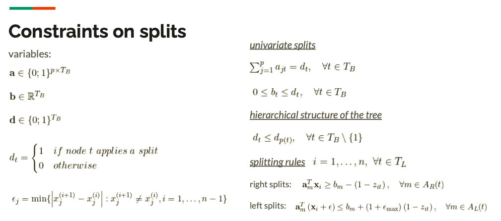
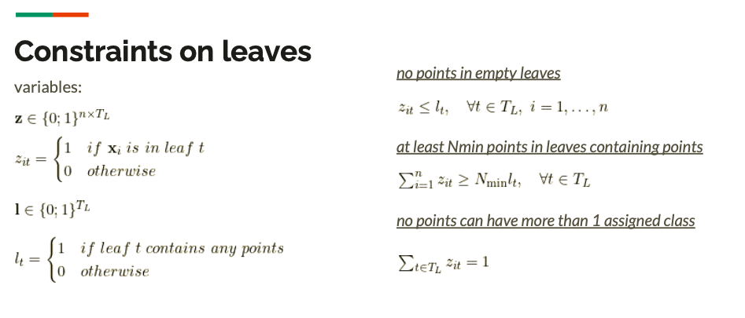
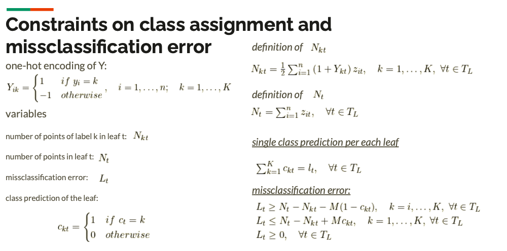
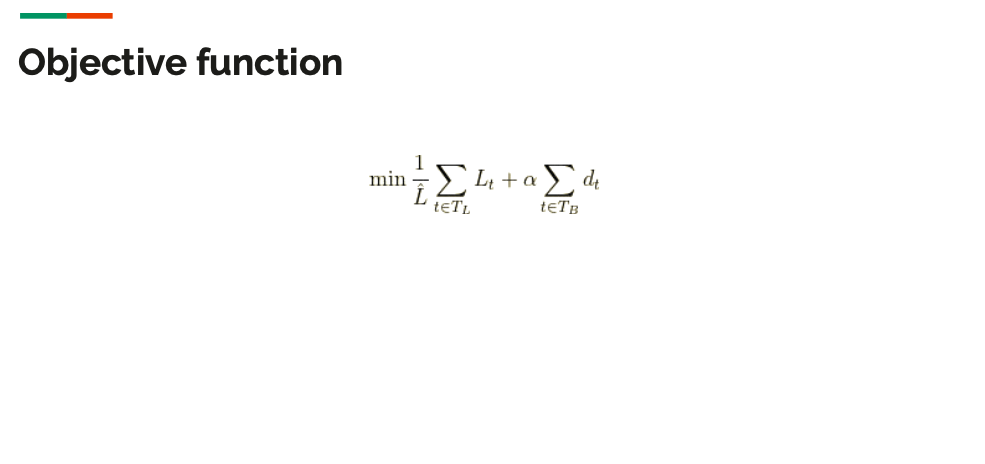
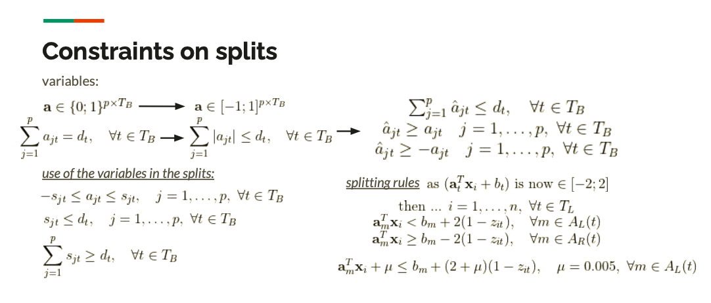
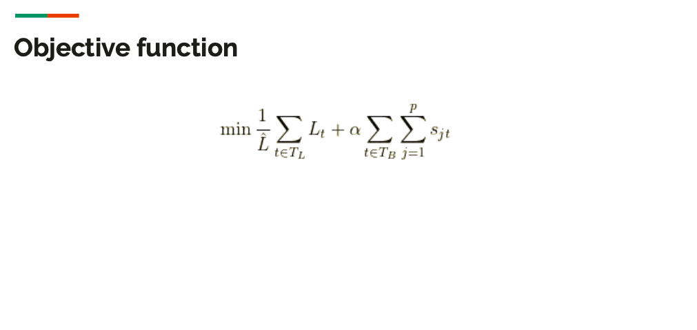
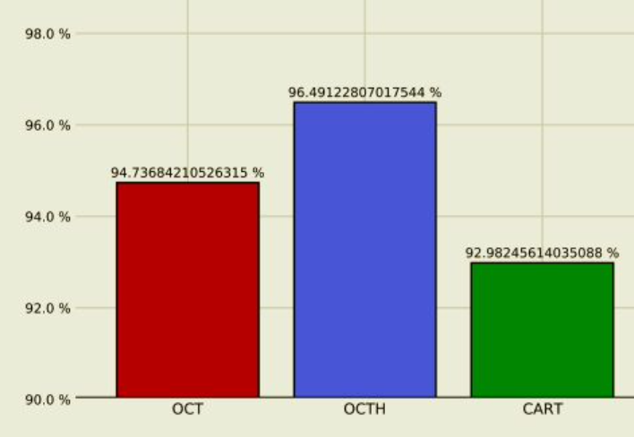

# OptimalClassificationTrees
Self-made (not perfect) implementation of Optimal Classification Trees by Bertsimas and Dunn (Mach Learn (2017) 106:1039–1082) 
<a href="https://www.mit.edu/~dbertsim/papers/Machine%20Learning%20under%20a%20Modern%20Optimization%20Lens/Optimal_classification_trees_MachineLearning.pdf">Link to the Article</a>

## Introduction 
The work is aimed at facing the classification task from a point of view which is different from that of traditional CARTs (Classification and Regression Trees) typically used in machine learning. Indeed, the classification of a set of data is addressed by means of ILP (Integer Linear Programming) instead of empirical, iterative splits-making algorithm, such as ID3 (Iterative Dichotomizer 3 [<a href="https://en.wikipedia.org/wiki/ID3_algorithm">wiki</a>]).  

The main problem of such algorithms is their "top-down" nature, i.e. splits are determined starting from the root node, down toward the leaves of the tree, by considerng, among all the possible splits, the one which gives you the best reduction in terms of missclassification error. However, once the split is given, the next choice is taken iteratively by do not considering neither the impact of the previous splits or of the future ones on the objective function. Plus, typically the pruning of the grown tree, used to avoid overfitting, is done as a subsequent, second step. 

The formulation of the construction of the classification, or regression, tree as an ILP problem allows, on a side, to make decisions on the branches in the tree by considering all the possible splits which can be made from the choice of the features, and, on the other side, to allow tree pruning in the same optimal solution by correctly formulating the objective function. 

Moreover, the ILP formulation allows you to easily considering splits that can take into account more than one feature at a time, without eccessive efforts in terms of problem statements, just by changing some of the constraints and the variables used in the formulation. 

### Notation 

## OCT: univariate splits formulation

## OCT-H: Optimal Classification Trees with Hyperplanes (multivariate splits formulation)

## Out of Samples accuracy comparison with respect to CARTs

